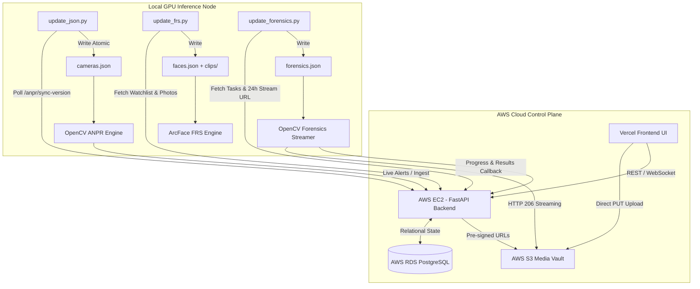

# 🎓 Z-TRACS Cloud-to-Edge Architecture Masterclass & Engineering Playbook
> **A Comprehensive Guide to Modern Real-Time Edge-AI Synchronization, AWS Cloud Infra, and Resilient System Design**

---

## 📑 Table of Contents
1. [Executive Overview & System Architecture](#1-executive-overview--system-architecture)
2. [The 5 Critical Engineering Challenges & Root Cause Analysis](#2-the-5-critical-engineering-challenges--root-cause-analysis)
3. [Deep-Dive System Design & Infrastructure Concepts](#3-deep-dive-system-design--infrastructure-concepts)
4. [The 3 Edge Listener Daemons Explained](#4-the-3-edge-listener-daemons-explained)
5. [Production Runbook & Troubleshooting Cheatsheet](#5-production-runbook--troubleshooting-cheatsheet)

---

## 1. Executive Overview & System Architecture

Z-TRACS is a distributed state-wide AI surveillance and computer vision platform consisting of three primary layers:
1. **Presentation Layer (Vercel)**: Next.js / React interactive dashboard for real-time monitoring, AI model configuration, polygon ROI drawing, FRS suspect watchlist management, and forensic video ingestion.
2. **Cloud Control Plane (AWS EC2 + RDS + S3)**:
   - **FastAPI Backend (EC2)**: High-throughput async REST API and WebSocket dispatcher.
   - **PostgreSQL Database (RDS)**: Relational state store for camera configs, polygon ROIs, suspect registries, forensic jobs, and live alerts.
   - **Evidence & Media Vault (S3)**: Object store for suspect reference photos and multi-gigabyte forensic CCTV footage.
3. **Edge Inference Layer (Local / On-Premise GPU Nodes)**:
   - Python-based daemons continuously synchronizing JSON state files.
   - OpenCV / YOLOv8 / ArcFace / OCR engines executing real-time inference on RTSP video feeds and video archives.



---

## 2. The 5 Critical Engineering Challenges & Root Cause Analysis

### 🔴 Problem 1: Frontend State Not Reflecting on Edge `cameras.json`
* **Symptoms**: User modified camera enable vectors (`[0, 1, 0, 0]`) and custom polygon ROIs from the frontend, but edge machines did not reflect the changes in `cameras.json`.
* **Root Cause**: 
  1. The edge script was initially re-fetching all 35 camera polygon datasets on every single loop, creating database read amplification and timeout locks.
  2. Camera codes were stored inconsistently (e.g. short `CAM-001` vs full canonical `CAM-GJ-AHM-SNTL-000001`), leading to mismatched lookup keys.
* **Engineering Solution**:
  - Implemented **Sub-Second Change Detection (`GET /anpr/sync-version`)**: The backend tracks single timestamp markers (`ai_configs_updated_at`, `rois_updated_at`). The edge script polls this lightweight 50-byte response every 2 seconds. Only when the timestamp increments does the daemon pull the full configuration.
  - Standardized canonical camera IDs and enabled atomic file replacements using temporary buffers to prevent partially-written JSON files.

---

### 🔴 Problem 2: Port 8000 Conflict on EC2 (`[Errno 98] Address already in use`)
* **Symptoms**: Attempting to restart Uvicorn on EC2 threw `OSError: [Errno 98] Address already in use`, preventing API restarts.
* **Root Cause**: 
  - An orphaned Python process (PID 359535) was previously started outside PM2. When PM2 tried to bind port 8000, the Linux kernel rejected the bind request because the socket was still held in `TIME_WAIT` or active `LISTEN` state by the orphaned process.
* **Engineering Solution**:
  - Used `sudo fuser -k 8000/tcp` to forcefully identify and terminate the zombie socket owner.
  - Transitioned deployment workflow to **`pm2 reload z-tracs-api`** instead of cold restarts. PM2 reload uses zero-downtime socket handoff, avoiding port collision.

---

### 🔴 Problem 3: S3 Multi-Region Signature Mismatch (`AuthorizationQueryParametersError`)
* **Symptoms**: When OpenCV attempted to stream forensic footage via the pre-signed S3 URL, AWS returned:
  `AuthorizationQueryParametersError: Error parsing the X-Amz-Credential parameter; the region 'ap-south-1' is wrong; expecting 'us-east-1'`.
* **Root Cause**:
  - The EC2 instance and RDS database were located in AWS Region **`ap-south-1` (Mumbai)**.
  - However, the S3 bucket `z-tracs-media` was created in **`us-east-1` (N. Virginia)**.
  - AWS Signature Version 4 (SigV4) requires that the region specified in the authorization token exactly matches the physical bucket region.
* **Engineering Solution**:
  - Decoupled cloud compute region from storage region in `backend/app/storage/s3.py`:
    ```python
    AWS_REGION = os.getenv("AWS_S3_REGION", os.getenv("AWS_REGION", "us-east-1"))
    ```
  - Configured pre-signed URL generator to explicitly sign with `us-east-1`, restoring instant HTTP streaming.

---

### 🔴 Problem 4: Multi-Gigabyte Forensic Video Upload Bottlenecks (EC2 Disk Exhaustion)
* **Symptoms**: Uploading 2GB–10GB CCTV files through the EC2 backend caused high memory consumption, disk space exhaustion, and request timeouts.
* **Root Cause**: 
  - Monolithic architecture pattern: Client -> EC2 Backend -> Local Disk -> S3.
* **Engineering Solution**:
  - Replaced monolithic upload with **Direct Browser-to-S3 Pre-Signed Uploads**:
    1. Frontend requests a pre-signed PUT URL from `/api/v1/forensics/upload-url`.
    2. Frontend streams video directly to S3 via HTTP `PUT`.
    3. EC2 server experiences **0% CPU / 0% Disk overhead** during video uploads.

---

### 🔴 Problem 5: Duplicate Camera Cards in Frontend UI
* **Symptoms**: In `AiModelsView.tsx`, the camera grid rendered duplicate cards for the same physical camera.
* **Root Cause**:
  - Backend returned some records keyed by index number (`001`) and others by full slug (`CAM-GJ-AHM-SNTL-000001`).
* **Engineering Solution**:
  - Created a robust canonical transformer in TypeScript:
    ```typescript
    const toCanonicalCode = (code: string): string => {
      const match = code.match(/(\d+)$/);
      if (match) {
        return `CAM-${match[1].padStart(3, "0")}`;
      }
      return code.trim().toUpperCase();
    };
    ```
  - Deduplicated UI state using JavaScript `Map` before rendering.

---

## 3. Deep-Dive System Design & Infrastructure Concepts

### 💡 Concept 1: Change Data Capture (CDC) via Lightweight Sync-Version Markers
Instead of polling a heavy 100KB endpoint every second:
- **Heavy Pattern (Bad)**: Edge polls `GET /cameras` (100KB) every 1s $\implies$ 8.6 GB/day per edge node.
- **CDC Sync-Version Pattern (Optimal)**: Edge polls `GET /sync-version` (50 bytes) every 1s $\implies$ negligible 4.3 MB/day. Full payload is fetched **only when version changes**.

```
Edge Node                      EC2 Backend                     PostgreSQL
   │                                │                              │
   │── GET /anpr/sync-version ─────>│                              │
   │<── {"v": 102} (No change) ─────│ (Reads in-memory/fast index) │
   │                                │                              │
   │ [User updates ROI in UI] ──────┼─────────────────────────────>│ (Updates DB)
   │                                │<── ai_configs_updated_at ────│ (v = 103)
   │                                │                              │
   │── GET /anpr/sync-version ─────>│                              │
   │<── {"v": 103} (Change detected)│                              │
   │                                │                              │
   │── GET /anpr/all-ai-configs ───>│── Query DB ─────────────────>│
   │<── Full JSON Payload ──────────│<── Fresh Configurations ─────│
   │                                │                              │
   │── Writes cameras.json ─────────│                              │
```

---

### 💡 Concept 2: Zero-Server-Footprint Media Architecture (S3 Pre-Signed URLs)
Private S3 buckets can grant granular, time-limited access without exposing root credentials or routing bytes through application servers:
* **Pre-signed PUT**: Grants temporary upload permission (1 hour) directly from browser to S3.
* **Pre-signed GET**: Grants temporary read permission (24 hours) for edge AI workers.

---

### 💡 Concept 3: HTTP 206 Range Requests for OpenCV Video Streaming
OpenCV `cv2.VideoCapture` uses FFMPEG under the hood. When given an S3 pre-signed HTTPS URL, FFMPEG utilizes **HTTP Range Headers**:
```http
GET /forensics/tasks/TSK-001/footage.mp4 HTTP/1.1
Host: z-tracs-media.s3.amazonaws.com
Range: bytes=1048576-2097152
```
* **Why this matters**:
  - The edge node never downloads the entire 10GB video.
  - It streams frames sequentially into memory on-the-fly.
  - Video seek/skip operations only download the specific byte range needed for that frame timestamp.

---

### 💡 Concept 4: Linux Socket Lifecycle & Zombie Process Management
When a server process terminates abnormally, its TCP socket can remain in the kernel socket table:
* `fuser -k 8000/tcp`: Sends `SIGKILL` directly to any process holding an open socket on TCP port 8000.
* `pm2 reload <app>`: Performs a zero-downtime cluster reload by spawning new workers and draining old sockets before closing.

---

### 💡 Concept 5: Atomic File Writes on Edge Nodes
To prevent computer vision models from reading a partially-written JSON file:
```python
# Unsafe: Can cause JSONDecodeError in OpenCV thread if read during write
with open("cameras.json", "w") as f:
  json.dump(data, f)

# Safe / Atomic:
temp_path = "cameras.json.tmp"
with open(temp_path, "w") as f:
  json.dump(data, f)
os.replace(temp_path, "cameras.json")  # Atomic file swap in OS kernel
```

---

## 4. The 3 Edge Listener Daemons Explained

| Daemon Script | Output File | Polling Endpoint | Core Responsibilities |
| :--- | :--- | :--- | :--- |
| **`update_json.py`** | `cameras.json` | `GET /anpr/sync-version`<br>`GET /anpr/all-ai-configs` | Syncs 35 RTSP streams, active AI model enable vectors `[ANPR, FRS, PPE, Footfall]`, and custom polygon ROIs. |
| **`update_frs.py`** | `faces.json`<br>`clips/{slug}/` | `GET /frs/targets` | Syncs criminal watchlist, smart MD5 version photo caching, auto-purges deleted targets from disk. |
| **`update_forensics.py`** | `forensics.json` | `GET /forensics/export-tasks` | Ingests batch forensic jobs, injects 24h S3 streaming URLs for `cv2.VideoCapture()`. |

---

## 5. Production Runbook & Troubleshooting Cheatsheet

### 🛠️ Common EC2 Operations
```bash
# 1. Zero-Downtime Code Update & Reload
cd ~/Z-TRACS && git pull && pm2 reload z-tracs-api

# 2. Check Service Status
pm2 status

# 3. View Live Backend Logs
pm2 logs z-tracs-api --lines 50

# 4. Clear Port 8000 if Stuck
sudo fuser -k 8000/tcp && pm2 restart z-tracs-api
```

### 🧪 Verifying Edge Daemons Locally
```powershell
# Check running edge listeners and file freshness
python -c "
import os, time, json, requests
print('Backend:', requests.get('http://43.204.235.231:8000/api/v1/anpr/sync-version').status_code)
for f in ['cameras.json', 'faces.json', 'forensics.json']:
    print(f, 'Age:', round(time.time() - os.path.getmtime(f), 1), 's')
"
```

---
*Document Version: 1.0.0 | System: Z-TRACS State-Wide AI Platform | Maintained by: Antigravity AI Engineering*
